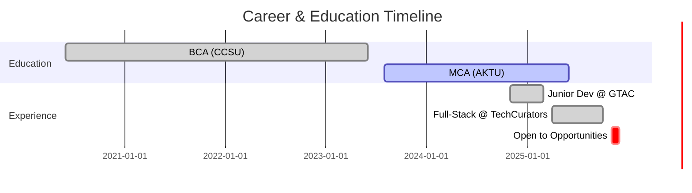

# 👋 Hey, I'm Tarun Gupta

<div align="center">
  
  [](https://git.io/typing-svg)
  
  
  
</div>

<br>

<div align="center">
  
  [](https://linkedin.com/in/tarun2606)
  [](https://geeksoft.site)
  [](mailto:tarun.gupta2606@gmail.com)
  [](https://github.com/TarunGupta2602)
  
  
  
</div>

<br>

## 🚀 About Me

```typescript
const tarun: Developer = {
  location: "Ghaziabad, India 🇮🇳",
  status: "Open to Opportunities",
  previousRole: "Full-Stack Developer @ TechCurators (Apr-Oct 2025)",
  
  education: {
    current: "MCA @ Inmantec Institutions, AKTU (2023-2025)",
    completed: "BCA @ Inmantec Institutions, CCSU (2020-2023)"
  },
  
  expertise: {
    frontend: ["React", "Next.js", "TypeScript", "Tailwind CSS"],
    backend: ["Node.js", "Express", "PostgreSQL", "MongoDB"],
    tools: ["Git", "Vercel", "Supabase", "Firebase"]
  },
  
  currentlyLearning: ["React Native", "GraphQL", "System Design"],
  interests: ["Clean Code", "Performance Optimization", "UI/UX Design"],
  
  lifePhilosophy: "Code is poetry written in logic ✨",
  dailyRoutine: () => {
    while (motivated) {
      code();
      learn();
      build();
      repeat();
    }
  }
};
```

<br>

## 💻 Tech Arsenal

<div align="center">

### Frontend Mastery


### Backend & Database


### Tools & Platforms


</div>

<br>

## 📊 GitHub Statistics

<div align="center">
  
  
</div>

<div align="center">
  
  
</div>

<br>

## 🏆 GitHub Trophies

<div align="center">
  
</div>

<br>

## 🎯 Featured Projects

<table align="center">
<tr>
  <td width="50%" valign="top">
    <h3 align="center">🌐 TransCurators</h3>
    <div align="center">
      <a href="https://transcurators.com" target="_blank">
        
      </a>
      <br><br>
      <p><strong>Premium Content Platform</strong></p>
      <p>
        • Full-stack application with Next.js & Supabase<br>
        • User authentication & role management<br>
        • SEO optimized & responsive design<br>
        • Real-time data synchronization
      </p>
      <p>
        
        
        
      </p>
    </div>
  </td>
  
  <td width="50%" valign="top">
    <h3 align="center">🛒 ShopEase</h3>
    <div align="center">
      <a href="https://shopease-eosin.vercel.app" target="_blank">
        
      </a>
      <br><br>
      <p><strong>Modern E-commerce Platform</strong></p>
      <p>
        • Dynamic shopping cart functionality<br>
        • Server-side rendering for performance<br>
        • TypeScript for type safety<br>
        • Seamless checkout experience
      </p>
      <p>
        
        
        
      </p>
    </div>
  </td>
</tr>

<tr>
  <td width="50%" valign="top">
    <h3 align="center">🏋️ Maharana Fitness</h3>
    <div align="center">
      <a href="https://maharana-fitness.vercel.app" target="_blank">
        
      </a>
      <br><br>
      <p><strong>Fitness Club Management System</strong></p>
      <p>
        • Member booking & scheduling system<br>
        • Dynamic fitness program management<br>
        • Mobile-first responsive design<br>
        • Admin dashboard integration
      </p>
      <p>
        
        
        
      </p>
    </div>
  </td>

  <td width="50%" valign="top">
    <h3 align="center">💼 GeekSoft</h3>
    <div align="center">
      <a href="https://geeksoft.site" target="_blank">
        
      </a>
      <br><br>
      <p><strong>Development Agency Portfolio</strong></p>
      <p>
        • Integrated payment processing<br>
        • Service showcase & booking system<br>
        • Client testimonials & reviews<br>
        • Shopify API integration
      </p>
      <p>
        
        
        
      </p>
    </div>
  </td>
</tr>
</table>

<br>

## 🎓 Journey So Far

<div align="center">



</div>

<br>

## 🏅 Certifications & Achievements

<div align="center">

| 🏆 Achievement | 📜 Details |
|:---|:---|
| **Front-End Development** | Great Learning Certified |
| **Python Programming** | Great Learning Certified |
| **Production Applications** | Built 7+ live projects with 10K+ visitors |
| **Performance Expert** | Optimized applications for 40%+ faster load times |
| **Code Quality** | Maintained 95%+ code review approval rate |

</div>

<br>

## 🔥 Current Focus

<div align="center">
  
```javascript
class Developer extends Human {
  constructor() {
    super();
    this.name = "Tarun Gupta";
    this.status = "Seeking new opportunities";
    this.currentlyWorking = [
      "Building personal projects",
      "Contributing to open source",
      "Learning React Native & GraphQL"
    ];
  }
  
  async findNextOpportunity() {
    const opportunities = await this.searchJobs({
      role: "Full-Stack Developer",
      skills: ["React", "Next.js", "TypeScript", "Node.js"],
      type: "Remote/Hybrid"
    });
    
    return opportunities.filter(job => 
      job.culture === "innovative" && 
      job.growthPotential === "high"
    );
  }
}
```

</div>

**What I'm up to:**
- 💼 **Actively seeking** Full-Stack Developer opportunities
- 🔨 Building innovative projects with modern tech stack
- 🌱 Expanding skills in **React Native** and **GraphQL**
- 🤝 Open to **freelance** and **contract** work
- 🎯 Contributing to **open source** projects
- 📚 Deepening knowledge in **System Design** and **Architecture**

<br>

## 💡 Fun Facts

<div align="center">
  
| 💭 | About Me |
|:---:|:---|
| ☕ | I turn coffee into code (mostly bugs, then features) |
| 🐛 | console.log() is my best debugging friend |
| 🎵 | Code better with lo-fi beats playing |
| 🌙 | Night owl developer - best code after 10 PM |
| 🎮 | Gaming break = mental debugger |
| 📖 | Always reading tech blogs and documentation |

</div>

<br>

## 🤝 Let's Connect & Collaborate!

<div align="center">
  
  
  
  ### I'm always interested in:
  
  ✨ **Collaborating** on innovative projects  
  💡 **Discussing** new technologies and ideas  
  🚀 **Building** something amazing together  
  📧 **Connecting** with fellow developers  
  
  ---
  
  [](https://linkedin.com/in/tarun2606)
  [](mailto:tarun.gupta2606@gmail.com)
  [](https://geeksoft.site)
  
</div>

<br>

---

<div align="center">
  
  
  
  <br>
  
  [](https://git.io/typing-svg)
  
  **⭐ If you like my work, consider starring some repositories!**
  
</div>
