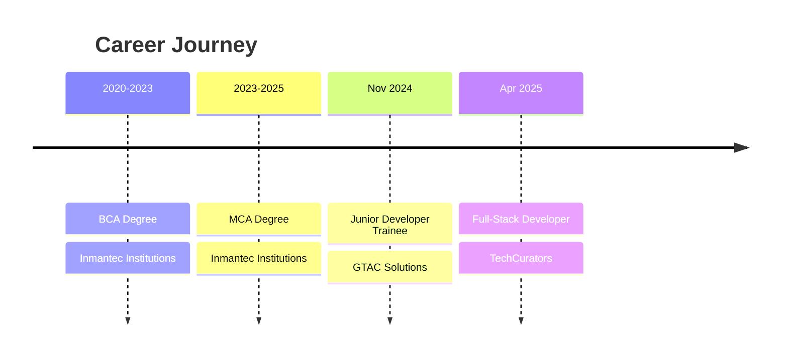

# Hi there, I'm Tarun Gupta 👋

<div align="center">
  
</div>

<div align="center">
  
</div>

## 🚀 About Me

```typescript
const tarun = {
  location: "Ghaziabad, India 🇮🇳",
  currentRole: "Full-Stack Developer @ TechCurators",
  education: {
    masters: "MCA - Inmantec Institutions, AKTU (2023-2025)",
    bachelors: "BCA - Inmantec Institutions, CCSU (2020-2023)"
  },
  passions: ["Clean Code", "User Experience", "Problem Solving"],
  currentFocus: "Building scalable web applications with modern tech stack",
  funFact: "I turn coffee into code and bugs into features! ☕→🐛→✨"
};
```

<div align="center">

[](https://linkedin.com/in/tarun2606)
[](mailto:tarun.gupta2606@gmail.com)
[](https://github.com/TarunGupta2602)
[](https://geeksoft.site)

</div>

## 💻 Tech Stack

<div align="center">

### Frontend


### Backend & Database


### Tools & Services


</div>

## 📊 GitHub Analytics

<div align="center">
  
  
</div>

<div align="center">
  
</div>

<div align="center">
  
</div>

## 🎯 Featured Projects

<div align="center">

<table>
<tr>
<td width="50%">

### 🌐 TransCurators
**Premium Content Platform**

[](https://transcurators.com)
[](https://github.com/TarunGupta2602)

Built with React, Next.js, Supabase
- Authentication & user management
- SEO optimized content delivery
- Responsive design system

</td>
<td width="50%">

### 🛒 ShopEase
**E-commerce Platform**

[](https://shopease-eosin.vercel.app)
[](https://github.com/TarunGupta2602)

Built with Next.js, TypeScript
- Dynamic shopping cart
- Server-side rendering
- Modern UI/UX design

</td>
</tr>
<tr>
<td width="50%">

### 🏋️ Maharana Fitness
**Fitness Club Platform**

[](https://maharana-fitness.vercel.app)
[](https://github.com/TarunGupta2602)

Built with Next.js, TypeScript, Supabase
- Member booking system
- Dynamic fitness programs
- Mobile-first design

</td>
<td width="50%">

### 💼 GeekSoft
**Development Agency Portfolio**

[](https://geeksoft.site)
[](https://github.com/TarunGupta2602)

Built with React, Next.js, Shopify API
- Integrated payment system
- Service showcase
- Client management

</td>
</tr>
</table>

</div>

## 🎓 Experience & Education

<div align="center">



</div>

## 🏆 Achievements

<div align="center">


</div>

- 🎖️ **Front-End Development** - Great Learning Certified
- 🐍 **Python Programming** - Great Learning Certified
- 🚀 **Built 7+ Production Applications** with 10K+ combined visits
- 💡 **Performance Optimization Expert** - Improved site speeds by 40%+

## 📈 Coding Activity

<div align="center">
  
[](https://github.com/TarunGupta2602)

</div>

## 💭 Currently...

<div align="center">

```javascript
while (alive) {
    eat();
    sleep();
    code();
    repeat();
    
    if (coffee.isEmpty()) {
        refill();
        continue;
    }
    
    if (bug.found()) {
        debug();
        celebrate();
    }
}
```

</div>

- 🔭 Working on **scalable web applications** with modern frameworks
- 🌱 Learning **React Native** and **GraphQL** for mobile development
- 👯 Looking to collaborate on **open source projects**
- 🤔 Exploring **AI/ML integration** in web applications
- 💬 Ask me about **React, Next.js, TypeScript, or Full-Stack Development**
- ⚡ Fun fact: **I debug with console.log and I'm proud of it!**

## 🤝 Let's Connect!

<div align="center">
  
  
  **Always open to interesting conversations and collaboration opportunities!**
  
  [](https://linkedin.com/in/tarun2606)
  [](mailto:tarun.gupta2606@gmail.com)
</div>

<div align="center">
  
</div>

---

<div align="center">
  
</div>
